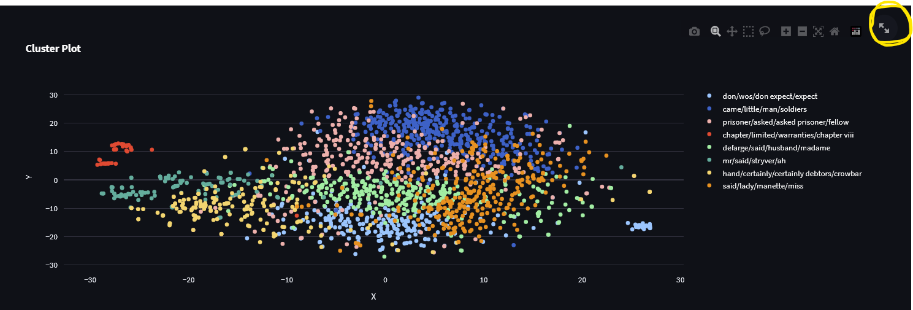

# Clustering Workbench
A python based tool for clustering text written using streamlit. 

[](https://www.youtube.com/watch?v=xI7giMvVZes)

## How does it work?
It uses [Google's Universal Sentence Encoder](https://tfhub.dev/google/universal-sentence-encoder-multilingual/3) along with [OpenTSNE](https://github.com/pavlin-policar/openTSNE) which is a very fast implementation of TSNEing. The tool can take in plain text files as inputs or CSV with single column (containing text). When supplied with plain text file as input it uses sentence embedding similarity to group sentences and create what we can call 'pseudo paragraphs'. If you don't want this to happen use the CSV mode. Also
, all the data including text, embeddings and TSNE output is available for download. A lot of code for this tool is derived from my old repo ['Feed Visualizer'](https://github.com/code2k13/feed-visualizer)

## How to run ?
```bash
streamlit run app.py
```
## How to use ?
Context based help is available for each of the options. Too lazy 🥱 to write down a manual here.

## How to see full screen charts ?
On the chart there is a button you can use to toggle full screen view
.

## What does 'use zero shot embedding' option to ?
Instead of using Google's 'Universal Sentence Transformer', it uses [Huggingface's zero shot classification](https://huggingface.co/tasks/zero-shot-classification) to create embedding for given labels.
Say you give labels "positive, negative, neutral", the generated embedding for a sentence might look like "0.3,0.4,0.3".

>Note: Don't play with this option unless you have a GPU. This is not yet tested feature with GPU on large data.


## References and thanks !

- https://github.com/pavlin-policar/openTSNE 
- https://huggingface.co/tasks/zero-shot-classification
- https://www.tensorflow.org/hub/tutorials/semantic_similarity_with_tf_hub_universal_encoder
